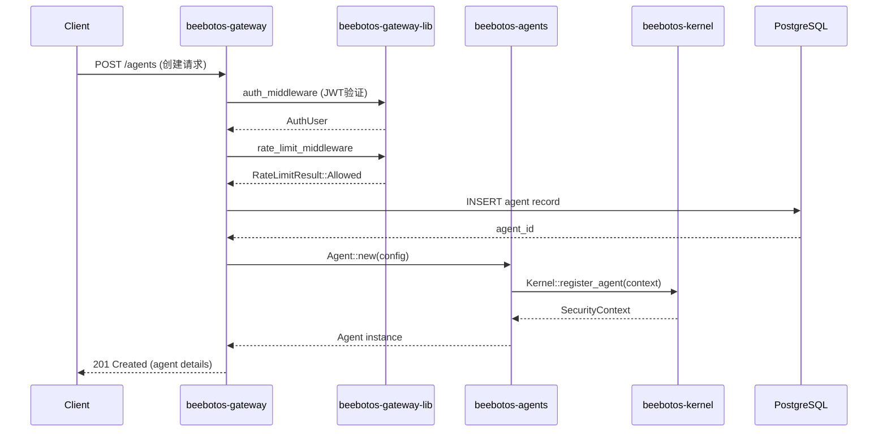
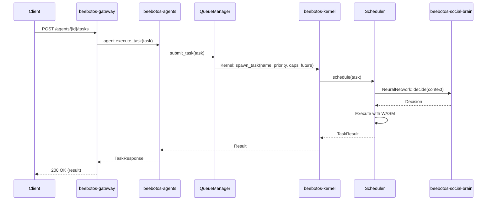
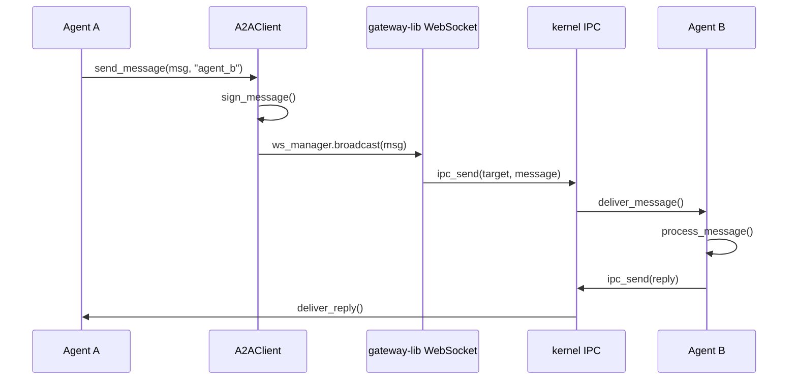
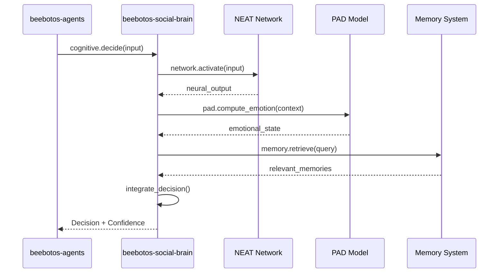

# BeeBotOS 模块业务逻辑关系分析

## 概述

本文档详细分析 `beebotos-gateway-lib`、`beebotos-gateway`、`beebotos-kernel`、`beebotos-agents` 和 `beebotos-social-brain` 五个核心模块之间的业务逻辑关系、依赖关系和数据流。

---

## 1. 模块架构概览

```
┌─────────────────────────────────────────────────────────────────────────────┐
│                              应用层 (Application)                              │
│  ┌──────────────────────────────────────────────────────────────────────┐   │
│  │                    beebotos-gateway (API Gateway)                     │   │
│  │  - HTTP/HTTPS 服务入口                                                  │   │
│  │  - 路由和负载均衡                                                        │   │
│  │  - 认证与授权                                                           │   │
│  │  - 数据库持久化 (PostgreSQL)                                             │   │
│  └──────────────────────────────────────────────────────────────────────┘   │
└─────────────────────────────────────────────────────────────────────────────┘
                                      │
                                      ▼ 依赖
┌─────────────────────────────────────────────────────────────────────────────┐
│                              网关库层 (Gateway Lib)                            │
│  ┌──────────────────────────────────────────────────────────────────────┐   │
│  │                 beebotos-gateway-lib (共享网关库)                       │   │
│  │  - 限流算法 (Token Bucket, Sliding Window)                             │   │
│  │  - JWT 认证与刷新                                                        │   │
│  │  - WebSocket 连接管理                                                    │   │
│  │  - 服务发现和熔断                                                        │   │
│  │  - 健康检查                                                             │   │
│  └──────────────────────────────────────────────────────────────────────┘   │
└─────────────────────────────────────────────────────────────────────────────┘
                                      │
                                      │ 被 apps/gateway 依赖
                                      ▼
┌─────────────────────────────────────────────────────────────────────────────┐
│                              运行时层 (Runtime)                                │
│  ┌─────────────────┐  ┌─────────────────┐  ┌─────────────────────────────┐   │
│  │ beebotos-agents │  │beebotos-social- │  │    beebotos-kernel          │   │
│  │  (Layer 3)      │◄─┤ brain (Layer 2) │◄─┤      (Layer 1)              │   │
│  │                 │  │                 │  │                             │   │
│  │ - Agent 运行时  │  │ - NEAT 神经网络 │  │ - 任务调度器                  │   │
│  │ - A2A 协议     │  │ - PAD 情感模型  │  │ - Capability 安全            │   │
│  │ - MCP 集成     │  │ - OCEAN 人格   │  │ - WASM 运行时                 │   │
│  │ - 会话管理     │  │ - 记忆系统      │  │ - 系统调用接口                │   │
│  │ - 任务队列     │  │ - 推理引擎      │  │ - 资源管理                   │   │
│  └─────────────────┘  └─────────────────┘  └─────────────────────────────┘   │
│           ▲                    ▲                    ▲                       │
│           │                    │                    │                       │
│           └────────────────────┴────────────────────┘                       │
│                              依赖关系                                        │
│                    agents ──► social-brain ──► kernel                        │
└─────────────────────────────────────────────────────────────────────────────┘
```

---

## 2. 各模块职责详解

### 2.1 beebotos-gateway-lib（网关共享库）

**定位**: 基础设施共享库，提供网关核心功能

**核心职责**:
- **限流管理**: Token Bucket、Sliding Window、Fixed Window 三种算法
- **认证授权**: JWT token 生成、验证、刷新机制
- **WebSocket 管理**: 连接状态管理、消息路由
- **服务发现**: 静态和动态服务发现、负载均衡
- **熔断器**: Circuit Breaker 模式实现
- **健康检查**: 组件健康状态监控

**对外暴露**:
```rust
pub mod config;      // GatewayConfig
pub mod rate_limit;  // RateLimitManager, TokenBucketRateLimiter
pub mod middleware;  // auth_middleware, rate_limit_middleware
pub mod websocket;   // WebSocketManager
pub mod health;      // HealthRegistry
pub mod discovery;   // ServiceRouter, LoadBalancer
```

---

### 2.2 beebotos-gateway（API 网关应用）

**定位**: 面向客户端的 HTTP/HTTPS 入口服务

**核心职责**:
- **API 路由**: RESTful API 端点定义
- **Agent 管理**: Agent 的 CRUD 操作
- **任务管理**: 任务提交、查询、取消
- **技能管理**: Skill 安装、卸载、更新
- **DAO 治理**: 提案、投票等治理功能
- **数据库持久化**: PostgreSQL 集成
- **可观测性**: Metrics、Tracing、Logging

**依赖关系**:
```toml
[dependencies]
beebotos-gateway-lib = { path = "../../crates/gateway" }  # 基础设施
beebotos-kernel = { workspace = true }                     # 内核功能
beebotos-agents = { workspace = true }                     # Agent 运行时
beebotos-chain = { workspace = true }                      # 区块链交互
```

**模块结构**:
```
apps/gateway/src/
├── agents.rs      # Agent API 处理器
├── tasks.rs       # 任务 API 处理器
├── skills.rs      # 技能 API 处理器
├── dao.rs         # DAO 治理处理器
├── auth.rs        # 认证逻辑
├── middleware.rs  # 中间件 (使用 gateway-lib)
├── rate_limit.rs  # 限流逻辑 (使用 gateway-lib)
└── health.rs      # 健康检查 (使用 gateway-lib)
```

---

### 2.3 beebotos-kernel（操作系统内核）

**定位**: Layer 1 核心操作系统功能

**核心职责**:
- **任务调度**: 抢占式调度、工作窃取、优先级队列
- **Capability 安全**: 11 级能力模型、访问控制
- **系统调用**: 29 个系统调用接口
- **WASM 运行时**: WebAssembly 执行环境
- **资源管理**: 内存、CPU、存储限制
- **IPC**: 进程间通信机制

**关键组件**:
```rust
pub mod scheduler;    // 任务调度器
pub mod capabilities; // Capability 系统
pub mod syscalls;     // 系统调用
pub mod security;     // 安全管理
pub mod wasm;         // WASM 引擎
pub mod memory;       // 内存管理
pub mod storage;      // 持久化存储
```

**对外服务**:
- `Kernel::spawn_task()` - 创建任务
- `Kernel::syscall()` - 系统调用分发
- `Kernel::compile_wasm()` - WASM 编译
- `CapabilitySet` - 权限管理

---

### 2.4 beebotos-agents（Agent 运行时）

**定位**: Layer 3 自主智能体运行时

**核心职责**:
- **Agent 生命周期**: 创建、运行、暂停、终止
- **A2A 协议**: Agent-to-Agent 通信
- **MCP 集成**: Model Context Protocol
- **会话管理**: Session 隔离、持久化
- **任务队列**: 多队列并发管理
- **子代理创建**: Non-blocking spawning
- **技能系统**: WASM 技能加载执行

**模块结构**:
```rust
pub mod a2a;          // A2A 协议实现
pub mod mcp;          // MCP 客户端
pub mod session;      // 会话管理
pub mod spawning;     // 子代理创建
pub mod scheduling;   // 心跳和 Cron
pub mod queue;        // 任务队列
pub mod skills;       // 技能系统
pub mod channels;     // 多平台通信
pub mod consensus;    // 多 Agent 共识
```

**依赖关系**:
```toml
[dependencies]
beebotos-core = { path = "../core" }
beebotos-kernel = { path = "../kernel" }    # 依赖内核调度
beebotos-chain = { path = "../chain" }      # 区块链交互
```

---

### 2.5 beebotos-social-brain（社会智能脑）

**定位**: Layer 2 认知架构层

**核心职责**:
- **NEAT 神经网络**: 神经网络进化和拓扑优化
- **PAD 情感模型**: 情绪识别和表达
- **OCEAN 人格**: 五大人格特质模型
- **记忆系统**: 多模态记忆存储和检索
- **推理引擎**: 演绎推理、知识图谱
- **注意力机制**: 选择性注意力、焦点管理

**模块结构**:
```rust
pub mod neat;         // NEAT 神经网络
pub mod pad;          // PAD 情感模型
pub mod personality;  // OCEAN 人格
pub mod memory;       // 记忆系统
pub mod reasoning;    // 推理引擎
pub mod attention;    // 注意力机制
pub mod cognitive;    // 认知状态
```

---

## 3. 业务逻辑交互关系

### 3.1 垂直调用链（Top-Down）

```
┌─────────────────────────────────────────────────────────────┐
│ 1. Client Request                                            │
│    POST /api/v1/agents/{id}/tasks                           │
└─────────────────────────────────────────────────────────────┘
                              │
                              ▼
┌─────────────────────────────────────────────────────────────┐
│ 2. beebotos-gateway                                          │
│    - 认证 (auth.rs)                                         │
│    - 限流 (gateway-lib rate_limit)                          │
│    - 路由到 handlers::tasks::create_task                    │
│    - 数据库持久化 (sqlx)                                     │
└─────────────────────────────────────────────────────────────┘
                              │
                              ▼
┌─────────────────────────────────────────────────────────────┐
│ 3. beebotos-agents                                           │
│    - Agent::execute_task()                                  │
│    - 创建 Task 上下文                                        │
│    - 提交到 QueueManager                                    │
└─────────────────────────────────────────────────────────────┘
                              │
                              ▼
┌─────────────────────────────────────────────────────────────┐
│ 4. beebotos-kernel                                           │
│    - Kernel::spawn_task()                                   │
│    - Scheduler 分配执行资源                                  │
│    - Capability 检查权限                                     │
│    - WASM 运行时执行                                         │
└─────────────────────────────────────────────────────────────┘
                              │
                              ▼
┌─────────────────────────────────────────────────────────────┐
│ 5. beebotos-social-brain (可选)                              │
│    - NEAT 网络决策                                          │
│    - PAD 情感计算                                           │
│    - 记忆检索                                               │
└─────────────────────────────────────────────────────────────┘
```

### 3.2 水平交互关系（Peer-to-Peer）

#### A2A 协议通信
```rust
// Agent A (beebotos-agents)
let client = A2AClient::new()?;
let message = A2AMessage::new(
    MessageType::Request,
    agent_a_id,
    Some(agent_b_id),
    payload,
);
client.send_message(message, "agent_b").await?;

// 通过 beebotos-gateway-lib WebSocket 传输
// 或内部 IPC (beebotos-kernel)
```

#### 共识协调
```rust
// beebotos-agents consensus 模块
// 使用 beebotos-kernel IPC 进行多 Agent 通信
// 达成 PBFT/Raft 共识
```

### 3.3 数据流示意图

```
┌─────────────────────────────────────────────────────────────────────────┐
│                         数据流向分析                                      │
└─────────────────────────────────────────────────────────────────────────┘

[外部请求]
     │
     │ HTTP/HTTPS
     ▼
[beebotos-gateway] ───────┐
     │                    │
     │ SQL                │ WebSocket
     ▼                    ▼
[PostgreSQL]    [beebotos-gateway-lib]
                     │
                     │ 内部调用
                     ▼
              [beebotos-agents] ───────┐
                     │                 │
                     │ 调度请求         │ A2A 消息
                     ▼                 ▼
              [beebotos-kernel]  [其他 Agents]
                     │
                     │ 资源分配
                     ▼
              [beebotos-social-brain] (认知计算)
                     │
                     │ 决策结果
                     ▼
              [返回响应链]
```

---

## 4. 关键交互场景

### 场景 1: Agent 创建流程



### 场景 2: 任务执行流程



### 场景 3: A2A 跨 Agent 通信



### 场景 4: 认知决策流程



---

## 5. 依赖矩阵

| 模块 | gateway-lib | gateway | kernel | agents | social-brain |
|------|-------------|---------|--------|--------|--------------|
| **gateway-lib** | - | 被依赖 | - | - | - |
| **gateway** | ✅ 依赖 | - | ✅ 依赖 | ✅ 依赖 | - |
| **kernel** | - | - | - | ✅ 依赖 | ✅ 依赖 |
| **agents** | - | - | ✅ 依赖 | - | 可选依赖 |
| **social-brain** | - | - | - | - | - |

**说明**:
- ✅ 依赖: 编译期依赖
- 被依赖: 被其他模块使用
- 可选依赖: 运行时可选

---

## 6. 接口契约

### 6.1 gateway-lib → gateway

```rust
// 限流接口
pub trait RateLimiter: Send + Sync {
    fn check_limit(&self, key: &str) -> RateLimitResult;
}

// 认证接口
pub fn auth_middleware<B>(
    State(state): State<Arc<GatewayState>>,
    request: Request<B>,
    next: Next<B>,
) -> impl Future<Output = Response>;

// WebSocket 管理
pub struct WebSocketManager {
    pub fn broadcast(&self, msg: WsMessage) -> Result<()>;
    pub fn send_to(&self, conn_id: &str, msg: WsMessage) -> Result<()>;
}
```

### 6.2 kernel → agents

```rust
// 任务调度
impl Kernel {
    pub async fn spawn_task<F>(
        &self,
        name: impl Into<String>,
        priority: Priority,
        capabilities: CapabilitySet,
        f: F,
    ) -> Result<TaskId>;
}

// Capability 检查
pub struct CapabilitySet;
impl CapabilitySet {
    pub fn has(&self, level: CapabilityLevel) -> bool;
    pub fn require(&self, level: CapabilityLevel) -> Result<()>;
}

// WASM 执行
pub fn compile_wasm(&self, wasm_bytes: &[u8]) -> Result<wasmtime::Module>;
pub fn instantiate_wasm(&self, module: &wasmtime::Module) -> Result<WasmInstance>;
```

### 6.3 agents → social-brain

```rust
// NEAT 神经网络
pub struct NeuralNetwork;
impl NeuralNetwork {
    pub fn activate(&self, inputs: &[f64]) -> Vec<f64>;
    pub fn evolve(&mut self, fitness: f64);
}

// PAD 情感模型
pub struct Pad;
impl Pad {
    pub fn compute_emotion(&self, context: &Context) -> Emotion;
    pub fn get_mood(&self) -> Mood;
}

// 记忆系统
pub struct MemorySystem;
impl MemorySystem {
    pub fn store(&self, memory: Memory) -> Result<()>;
    pub fn retrieve(&self, query: &Query) -> Vec<Memory>;
}
```

---

## 7. 部署架构

```
┌─────────────────────────────────────────────────────────────────┐
│                         生产环境部署                              │
├─────────────────────────────────────────────────────────────────┤
│                                                                  │
│  ┌─────────────────────────────────────────────────────────┐    │
│  │              Load Balancer (Nginx/HAProxy)               │    │
│  └─────────────────────────────────────────────────────────┘    │
│                              │                                   │
│              ┌───────────────┼───────────────┐                   │
│              ▼               ▼               ▼                   │
│  ┌──────────────────┐ ┌──────────────────┐ ┌──────────────────┐ │
│  │ beebotos-gateway │ │ beebotos-gateway │ │ beebotos-gateway │ │
│  │   (Instance 1)   │ │   (Instance 2)   │ │   (Instance N)   │ │
│  └────────┬─────────┘ └────────┬─────────┘ └────────┬─────────┘ │
│           │                    │                    │            │
│           └────────────────────┼────────────────────┘            │
│                                ▼                                 │
│  ┌─────────────────────────────────────────────────────────┐    │
│  │              PostgreSQL (Primary-Replica)                │    │
│  └─────────────────────────────────────────────────────────┘    │
│                                │                                 │
│  ┌─────────────────────────────────────────────────────────┐    │
│  │           beebotos-agents (Agent Runtime Pool)           │    │
│  │  ┌─────────┐ ┌─────────┐ ┌─────────┐ ┌─────────┐       │    │
│  │  │ Agent 1 │ │ Agent 2 │ │ Agent 3 │ │ Agent N │       │    │
│  │  └────┬────┘ └────┬────┘ └────┬────┘ └────┬────┘       │    │
│  │       └─────────────┴──────────┴───────────┘             │    │
│  │                         │                                │    │
│  │              ┌──────────┴──────────┐                     │    │
│  │              ▼                     ▼                     │    │
│  │  ┌──────────────────┐  ┌──────────────────┐             │    │
│  │  │ beebotos-kernel  │  │beebotos-social-  │             │    │
│  │  │   (Scheduler)    │  │     brain        │             │    │
│  │  └──────────────────┘  └──────────────────┘             │    │
│  └─────────────────────────────────────────────────────────┘    │
│                                                                  │
└─────────────────────────────────────────────────────────────────┘
```

---

## 8. 总结

### 8.1 分层架构

| 层级 | 模块 | 职责 |
|------|------|------|
| **接入层** | beebotos-gateway | HTTP API、认证、路由、持久化 |
| **基础设施层** | beebotos-gateway-lib | 限流、WebSocket、服务发现 |
| **应用层** | beebotos-agents | Agent 运行时、A2A、MCP、任务调度 |
| **认知层** | beebotos-social-brain | 神经网络、情感、人格、记忆 |
| **内核层** | beebotos-kernel | 任务调度、Capability 安全、WASM |

### 8.2 核心设计原则

1. **关注点分离**: 每个模块有明确的职责边界
2. **依赖单向性**: 上层依赖下层，避免循环依赖
3. **可测试性**: 模块间通过接口契约交互，便于 Mock
4. **可扩展性**: 通过 Feature flags 支持可选功能
5. **安全性**: Capability-based 安全模型贯穿各层

### 8.3 关键数据流

1. **外部请求**: gateway → gateway-lib → agents → kernel → social-brain
2. **Agent 通信**: agents → kernel IPC → agents (A2A)
3. **认知计算**: agents → social-brain → agents
4. **资源管理**: 所有模块通过 kernel 统一管理资源

---

*文档生成时间: 2026-03-22*
*版本: BeeBotOS V1.0*

&&&&&&&&&&&&&&&&&&&&&&&&&&&&&&&&&&&&&&&
已完成 `beebotos-gateway-lib` 与其他核心模块之间的业务逻辑关系分析文档。

## 分析总结

### 模块层级架构

| 层级 | 模块 | 核心职责 |
|------|------|----------|
| **接入层** | `beebotos-gateway` | HTTP API、认证授权、路由、PostgreSQL 持久化 |
| **基础设施层** | `beebotos-gateway-lib` | 限流算法、JWT、WebSocket、服务发现、熔断器 |
| **应用层** | `beebotos-agents` | Agent 运行时、A2A 协议、MCP、任务队列、会话管理 |
| **认知层** | `beebotos-social-brain` | NEAT 神经网络、PAD 情感、OCEAN 人格、记忆系统 |
| **内核层** | `beebotos-kernel` | 任务调度、Capability 安全、WASM 运行时、系统调用 |

### 关键依赖关系

```
beebotos-gateway
    ├──► beebotos-gateway-lib (基础设施)
    ├──► beebotos-kernel (任务执行)
    └──► beebotos-agents (Agent 管理)

beebotos-agents
    ├──► beebotos-kernel (调度 + 安全)
    └──► beebotos-chain (区块链)

beebotos-social-brain
    └──► beebotos-core (基础类型)
```

### 文档内容

生成的文档包含：

1. **架构概览图** - 可视化模块关系
2. **各模块职责详解** - 功能边界和对外接口
3. **业务逻辑交互** - 垂直调用链和水平交互
4. **关键交互场景** - Agent 创建、任务执行、A2A 通信、认知决策
5. **依赖矩阵** - 模块间依赖关系表
6. **接口契约** - 模块间 API 定义
7. **部署架构** - 生产环境部署图

文档已保存至 `beebotos-modules-relationship-analysis.md`。

